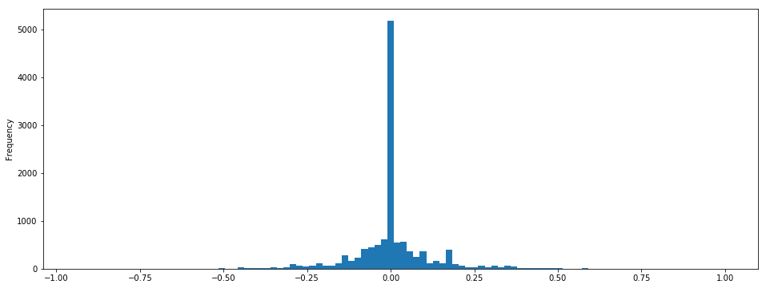
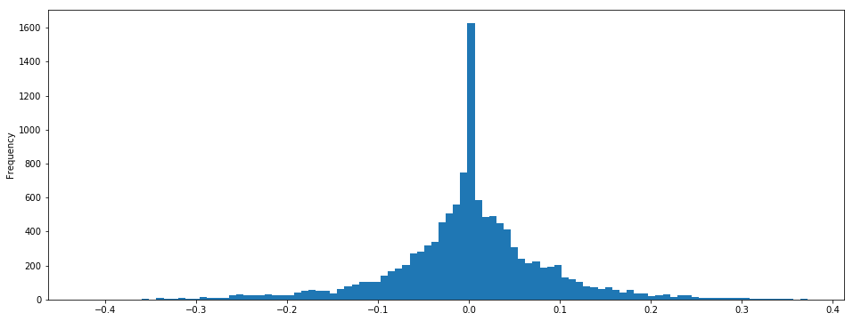
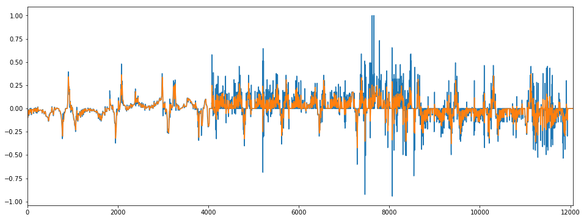
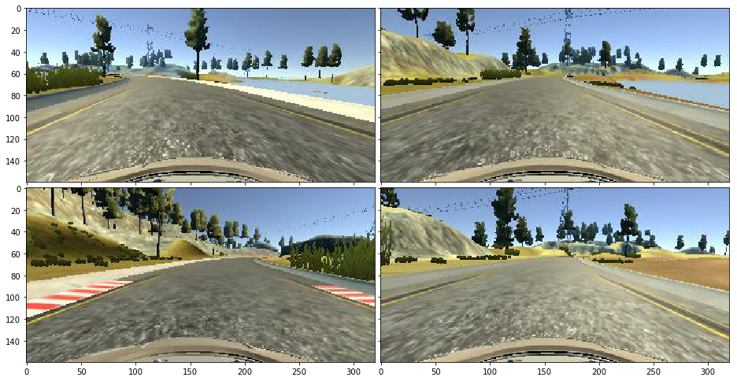
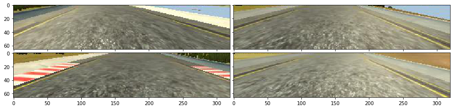
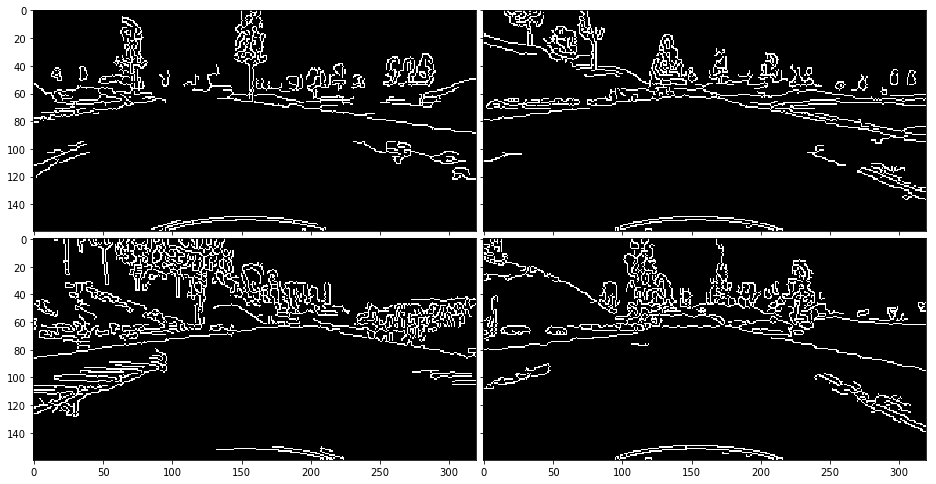
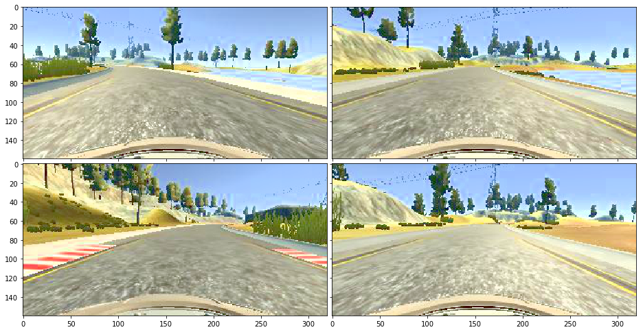
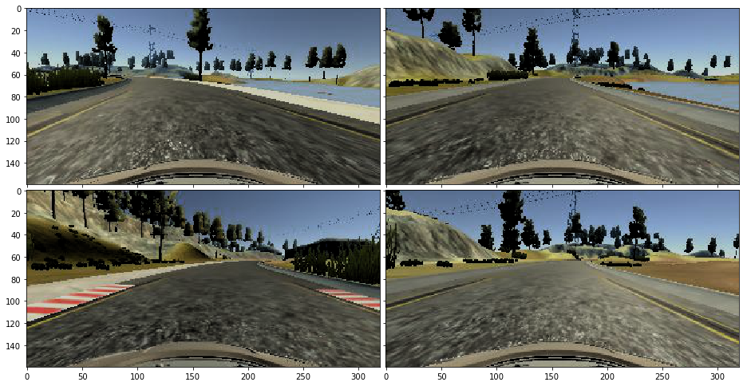
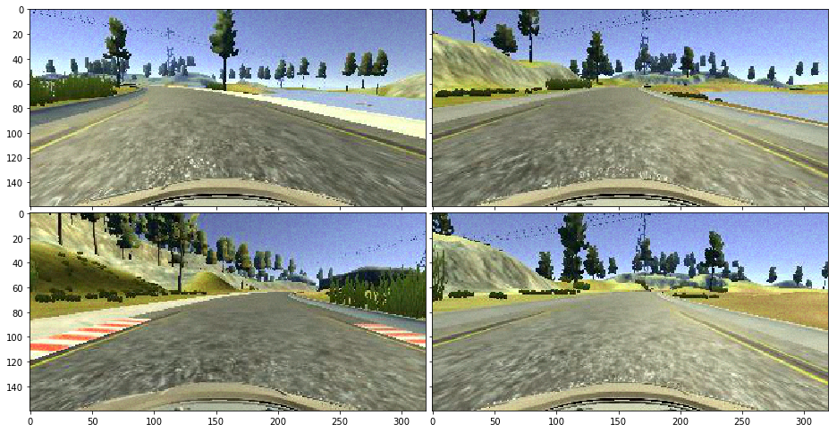
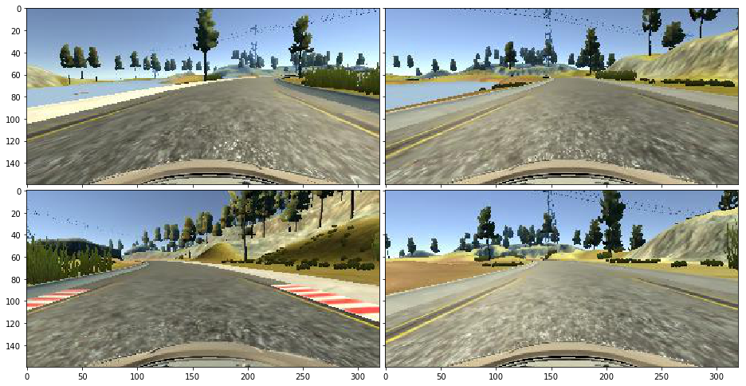

# CarND Project 3: Behavioral Cloning


```python
import os
import argparse

import numpy as np
import pandas as pd
import cv2
import random
import math

from keras.models import Sequential
from keras.layers.core import Dense, Dropout, Flatten, Lambda
from keras.layers.convolutional import Conv2D, Cropping2D
from keras.backend import tf as ktf

from sklearn.model_selection import train_test_split
from sklearn.utils import shuffle

import matplotlib
import matplotlib.pyplot as plt
import matplotlib.image as mpimg
from mpl_toolkits.axes_grid1 import ImageGrid

%matplotlib inline

FIGSIZE = (16, 6)
INPUT_FOLDER = 'mydata'
CROP_TOP, CROP_BOTTOM = 70, 24
MODEL_FILENAME = 'model.h5'
```

    Using TensorFlow backend.


```python
def read_csv(filename):
    columns = ('center', 'left', 'right', 'steering', 'throttle', 'brake', 'speed')
    df = pd.read_csv(filename, skipinitialspace=True)
    df.columns = columns
    return df

def smoothen_steering(df, count=5):
    return df.ewm(span=count).mean()['steering']

def fix_image_paths(df, folder):
    fixpath = lambda s: os.path.join(folder, s.split('/')[-1])
    df['center'] = df['center'].map(fixpath)
    df['left'] = df['left'].map(fixpath)
    df['right'] = df['right'].map(fixpath)
    return df

def load_image(path):
    img = cv2.imread(path)
    return cv2.cvtColor(img, cv2.COLOR_BGR2HSV)

def detect_input_shape(df):
    sample_image = df['center'].iloc[1]
    return load_image(sample_image).shape

def read_all_csvs_in_folder(parent_folder, min_speed=0.1):
    folders = os.listdir(parent_folder)
    folders = [os.path.join(parent_folder, folder) for folder in folders]
    
    data = []
    for folder in folders:
        df = read_csv(os.path.join(folder, 'driving_log.csv'))
        df = fix_image_paths(df, os.path.join(folder, 'IMG'))
        df['smooth_steering'] = smoothen_steering(df, count=10)
        data.append(df)
    
    columns = data[0].columns
    data = pd.DataFrame(data=np.concatenate(data), columns=columns)
    return data[data['speed'] >= min_speed]

data = read_all_csvs_in_folder(INPUT_FOLDER)
input_shape = detect_input_shape(data)
```

## A glimpse at the data


```python
print('{} center image frames in total'.format(len(data)))
print('Input images have shape: {}'.format(input_shape))
```

    12043 center image frames in total
    Input images have shape: (160, 320, 3)


```python
data['steering'].plot.hist(bins=100, figsize=FIGSIZE)
```


    <matplotlib.axes._subplots.AxesSubplot at 0x13ae21a20>





```python
data['smooth_steering'].plot.hist(bins=100, figsize=FIGSIZE)
```


    <matplotlib.axes._subplots.AxesSubplot at 0x13ec40208>





```python
print('Steering left: {}'.format(len(data[data['steering'] < 0])))
print('Steering right: {}'.format(len(data[data['steering'] > 0])))
print('Steering straight: {}'.format(len(data[data['steering'] == 0])))
```

    Steering left: 3883
    Steering right: 3740
    Steering straight: 4420


### Observation

As can be seen, the distribution of steering angles is off. There's disproportionately more data for straight driving (`steering~=0`). Furthermore, it seems that there's slightly more data for steering to the right.


```python
data['steering'].plot.line(figsize=FIGSIZE)
data['smooth_steering'].plot.line(figsize=FIGSIZE)
```


    <matplotlib.axes._subplots.AxesSubplot at 0x13f05a630>





```python
def crop(img):
    return img[CROP_TOP:img.shape[0]-CROP_BOTTOM, :, :]

def display(images, cols=2):
    shape = images[0].shape
    n_cols = cols if len(images) > cols else len(images)
    width = FIGSIZE[0]
    fig1 = plt.figure(1, (width, width * math.ceil(len(images)/n_cols)))
    grid1 = ImageGrid(fig1, 111,
                     nrows_ncols=(math.ceil(len(images)/n_cols), n_cols),
                     axes_pad=0.1,
                    )

    for index, img in enumerate(images):
        if len(shape) == 2:
            grid1[index].imshow(img, cmap='gray')
        else:
            grid1[index].imshow(cv2.cvtColor(img, cv2.COLOR_HSV2RGB))
```


```python
samples = np.random.choice(data.index, 4, replace=False)
print(samples)
sample_images = [load_image(data.iloc[sample]['center']) for sample in samples]
display(sample_images, cols=2)
```

    [11633  6990  5984  2762]





```python
sample_images_cropped = [crop(load_image(data.iloc[sample]['center'])) for sample in samples]
print('Cropped image dimensions: {}'.format(sample_images_cropped[0].shape))
display(sample_images_cropped, cols=2)
```

    Cropped image dimensions: (66, 320, 3)





#### Use Canny Edge Detection?


```python
def preprocess_with_canny(img):
    grayscale = cv2.cvtColor(img, cv2.COLOR_RGB2GRAY)
    blurred = cv2.GaussianBlur(grayscale, (3, 3), 0)
    low_threshold = 50
    high_threshold = 150
    return cv2.Canny(blurred, low_threshold, high_threshold)
```


```python
canny_images = list(map(preprocess_with_canny, sample_images))
display(canny_images, cols=2)
```





```python
THRESHOLD = 0.05
random.seed()
```


```python
def adjust_brightness(img_steering, amount):
    img, steering = img_steering
    result = img.copy().astype(np.int16)
    result[:,:,2] += amount
    result = np.clip(result, 0, 255).astype(np.uint8)
    return result, steering

def add_noise(img_steering, maximum=10):
    img, steering = img_steering
    noise = np.random.randint(0, high=maximum, size=img.shape)
    result = img.copy().astype(np.int16)
    result = np.clip(np.rint(result + noise), 0, 255).astype(np.uint8)
    return result, steering

def flip(img, steering):
    return np.fliplr(img.copy()), -steering

def get_side_image(left: bool, image, center_steering, steering_correction=0.25):
    steering = (center_steering + steering_correction) if left else (center_steering - steering_correction)
    return image, steering
```


```python
sample_images_bright = [adjust_brightness((img, 0), 50)[0] for img in sample_images]
sample_images_dark = [adjust_brightness((img, 0), -50)[0] for img in sample_images]
sample_images_noise = [add_noise((img, 0))[0] for img in sample_images]
sample_images_flip = [flip(img, 0)[0] for img in sample_images]
```


```python
display(sample_images_bright, cols=2)
```





```python
display(sample_images_dark, cols=2)
```





```python
display(sample_images_noise)
```





```python
display(sample_images_flip)
```




